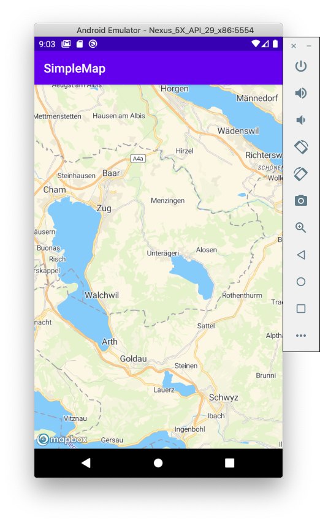

# MapTiler Tutorial for Android

This tutorial describes how to create a simple Android application using Kotlin and Android SDK.

> This tutorial was written for macOS

## Create new project

Open Android Studio and create new project and choose Empty Activity template. In the "Language" dropdown select "kotlin" and keep minimum API SDK to 16.

## Add MapBox SDK to the project

Add MapBox SDK to your project using Maven.

1. Open the project in Android Studio.
1. Open up module-level (/app/build.gradle) file.
1. Under dependencies, add a new build rule for the latest mapbox-android-sdk.

    ```
        dependencies {
            ...
            implementation 'com.mapbox.mapboxsdk:mapbox-android-sdk:9.2.0'
            ...
        }
    ```

## MapTiler Key

1. Create [MapTiler cloud](https://www.maptiler.com/cloud/) account.
1. [Obtain the api key](https://cloud.maptiler.com/account/keys).
1. Add the key for MapTile key to the application manifest (`/app/src/main/AndroidManifest.xml`)

    ```xml
        <?xml version="1.0" encoding="utf-8"?>
        <manifest xmlns:android="http://schemas.android.com/apk/res/android"
            package="com.maptiler.simplemap">

            <application ... >
                ...
                <meta-data android:name="com.maptiler.simplemap.mapTilerKey" android:value="your key" />
                ...
            </application>
        </manifest>
    ```

1. Open `MainActivity.kt file`. Add code to read MapTilerKey from the manifest.

    ```kotlin
    private fun getMapTilerKey(): String? {
        return packageManager.getApplicationInfo(
            packageName,
            PackageManager.GET_META_DATA
        ).metaData.getString("com.maptiler.simplemap.mapTilerKey")
    }
    ```

## Add the layout for the map

1. Navigate to `/app/res/layout` folder in Android Studio
1. Add new layout named `activity_main.xml`

    ```xml
        <?xml version="1.0" encoding="utf-8"?>
        <androidx.constraintlayout.widget.ConstraintLayout xmlns:android="http://schemas.android.com/apk/res/android"
            xmlns:app="http://schemas.android.com/apk/res-auto"
            xmlns:tools="http://schemas.android.com/tools"
            android:layout_width="match_parent"
            android:layout_height="match_parent"
            tools:context=".MainActivity">

            <com.mapbox.mapboxsdk.maps.MapView
                android:id="@+id/mapView"
                android:layout_width="match_parent"
                android:layout_height="match_parent"
                />

        </androidx.constraintlayout.widget.ConstraintLayout>    
    ```

## Initialize Map View

1. Open the `MainActivity.kt` file.
1. Add the member variable to hold MapView instance into `MainActivity` class

    ```kotlin
    private var mapView: MapView? = null
    ```

1. Add the following code to the `onCreate` method in order to construct map view.

    ```kotlin
    override fun onCreate(savedInstanceState: Bundle?) {
        super.onCreate(savedInstanceState)

        val mapTilerKey = getMapTilerKey()
        validateKey(mapTilerKey)
        val styleUrl = "https://api.maptiler.com/maps/streets/style.json?key=${mapTilerKey}";

        // Get the MapBox context
        Mapbox.getInstance(this, null)

        // Set the map view layout
        setContentView(R.layout.activity_main)

        // Create map view
        mapView = findViewById(R.id.mapView)
        mapView?.onCreate(savedInstanceState)
        mapView?.getMapAsync { map ->
            // Set the style after mapView was loaded
            map.setStyle(styleUrl) {
                map.uiSettings.setAttributionMargins(15, 0, 0, 15)
                // Set the map view center
                map.cameraPosition = CameraPosition.Builder()
                    .target(LatLng(47.127757, 8.579139))
                    .zoom(10.0)
                    .build()
            }
        }
    }
    ```

## Handle application lifecycle events

Add the following code to `MainActivity` in order to handle application lifecycle events

```kotlin
    override fun onStart() {
        super.onStart()
        mapView?.onStart()
    }

    override fun onResume() {
        super.onResume()
        mapView?.onResume()
    }

    override fun onPause() {
        super.onPause()
        mapView?.onPause()
    }

    override fun onStop() {
        super.onStop()
        mapView?.onStop()
    }

    override fun onSaveInstanceState(outState: Bundle) {
        super.onSaveInstanceState(outState)
        mapView?.onSaveInstanceState(outState)
    }

    override fun onLowMemory() {
        super.onLowMemory()
        mapView?.onLowMemory()
    }

    override fun onDestroy() {
        super.onDestroy()
        mapView?.onDestroy()
    }
```


