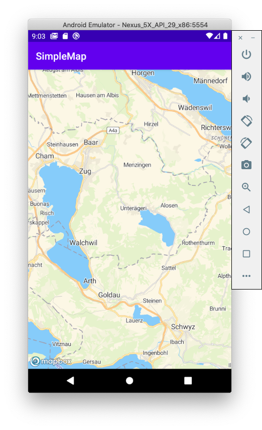

# MapTiler Tutorial for Android

This tutorial describes how to create a simple Android application using Kotlin and Android SDK.

> This tutorial was written for macOS

## Create new project

Open Android Studio and create new project and choose Empty Activity template. In the "Language" dropdown select "kotlin" and keep minimum API SDK to 16.

## Add MapLibre SDK to the project

Add MapLibre SDK to your project using Maven.

1. Open the project in Android Studio.
1. Open up project-level (/build.gradle) file.
1. Add bintray maven repositories to your build.gradle at project level so that you can access MapTiler packages for Android:

    ```gradle
        allprojects {
            repositories {
                ...
                maven {
                    url = "https://dl.bintray.com/maplibre/maplibre-gl-native"
                }
            }
        }
    ```
1. Open up module-level (/app/build.gradle) file.
1. Under dependencies, add a new build rule for the latest maplibre android-sdk.

    ```gradle
        dependencies {
            ...
            implementation 'org.maplibre.gl:android-sdk:9.2.1'
            ...
        }
    ```

## MapTiler Key

1. Create [MapTiler cloud](https://www.maptiler.com/cloud/) account.
1. [Obtain the api key](https://cloud.maptiler.com/account/keys).
1. Add the key for MapTile key to the module-level build.gradle

    ```gradle
    android {
        ...
        defaultConfig {
            ...
            resValue "string", "mapTilerKey", "your key"
        }
    ```

1. Open `MainActivity.kt file`. Add code to read MapTilerKey from the manifest.

    ```kotlin
    snippet(MainActivity.kt#GetKey)
    ```

## Add the layout for the map

1. Navigate to `/app/res/layout` folder in Android Studio
1. Add new layout named `activity_main.xml`

    ```xml
        <?xml version="1.0" encoding="utf-8"?>
        <androidx.constraintlayout.widget.ConstraintLayout xmlns:android="http://schemas.android.com/apk/res/android"
            xmlns:app="http://schemas.android.com/apk/res-auto"
            xmlns:tools="http://schemas.android.com/tools"
            android:layout_width="match_parent"
            android:layout_height="match_parent"
            tools:context=".MainActivity">

            <com.mapbox.mapboxsdk.maps.MapView
                android:id="@+id/mapView"
                android:layout_width="match_parent"
                android:layout_height="match_parent"
                />

        </androidx.constraintlayout.widget.ConstraintLayout>    
    ```

## Initialize Map View

1. Open the `MainActivity.kt` file.
1. Add the member variable to hold MapView instance into `MainActivity` class

    ```kotlin
    snippet(MainActivity.kt#MapViewMember)
    ```

1. Add the following code to the `onCreate` method in order to construct map view.

    ```kotlin
    snippet(MainActivity.kt#MapInit)
    ```

## Handle application lifecycle events

Add the following code to `MainActivity` in order to handle application lifecycle events

```kotlin
snippet(MainActivity.kt#onStart)

snippet(MainActivity.kt#onResume)

snippet(MainActivity.kt#onPause)

snippet(MainActivity.kt#onStop)

snippet(MainActivity.kt#onSaveInstanceState)

snippet(MainActivity.kt#onLowMemory)

snippet(MainActivity.kt#onDestroy)
```


