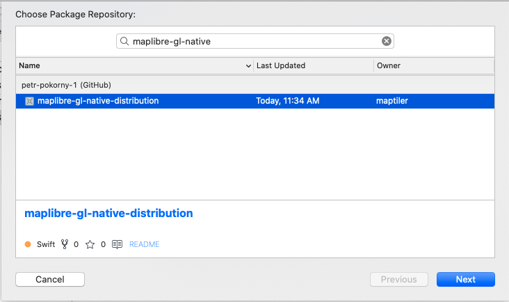

# Installation

Before starting to develop your application with the MapLibre Maps SDK, you'll need to add the SDK as a dependency and configure location permissions.

## Install the SDK

Add MapLibre SDK to your project using Swift Package Manager.

1. To add a package dependency to your Xcode project, select File > Swift Packages > Add Package Dependency and enter its repository URL. You can also navigate to your target’s General pane, and in the “Frameworks, Libraries, and Embedded Content” section, click the + button, select Add Other, and choose Add Package Dependency.
1. Either add MapLibre GitHub distribution URL (https://github.com/maplibre/maplibre-gl-native-distribution) or search for `maplibre-gl-native` package.  

  

1. Choose "next". Xcode should clone the distribution repository and download the binaries. Choose both mapBox and MapBox Mobile Events libraries.  


## Configure location permissions

The MapLibre Maps SDK for iOS requests permissions for user location on your behalf when MGLMapView.showsUserLocation is set to YES.

Prior to iOS 14, the device could only send the user’s exact location. With iOS 14, users can opt into [Approximate Location](https://www.apple.com/ios/ios-14-preview/features/). Since users may toggle precise location off when initial permission for their location is requested by the app or in the System settings, developers are strongly encouraged to support Approximate Location.

## Handle the User Interface

The Maps SDK provides an approximate user location indicator that mirrors the approximate user location indicator previewed by Apple. This indicator will appear by default when MGLMapView.showsUserLocation is set to YES and precise location has been opted out. You may further configure or hide this component.

## Request temporary access to precise location

Certain application features may require precise location. The MapLibre Maps SDK for iOS provides a wrapper of Apple’s CoreLocation APIs that requests temporary access to precise location when the user has opted out at the application settings level: 

```objective-c
[MGLLocationManager.requestTemporaryFullAccuracyAuthorizationWithPurposeKey:]
```

Make the following adjustments to your Info.plist file to provide explanations for system prompts that may appear during location prompts - provide users a brief explanation of how the app will use their location data for temporary access:

```xml
<key>NSLocationWhenInUseUsageDescription</key>
<string>Your precise location is used to show your location on the map.</string>
```

Add MGLAccuracyAuthorizationDescription as an element of the NSLocationTemporaryUsageDescriptionDictionary dictionary to give users a brief explanation of why a feature in your app requires their exact location:

```xml
<key>NSLocationTemporaryUsageDescriptionDictionary</key>
<dict>
    <key>MGLAccuracyAuthorizationDescription</key>
    <string>Please enable precise location. Display of your position on the map only works when precise location data is available.</string>
</dict>
```

As a convenience, if your application uses a MGLMapView.userTrackingMode to track user location, the Maps SDK will check for full accuracy authorization and request access on your behalf.

## Handle changes in location authorization

At any point, a user may grant or revoke access to precise location in System settings. The Maps SDK for iOS provides a delegate method to handle these changes:

```objective-c
[MGLMapViewDelegate mapView:didChangeLocationManagerAuthorization:]
```

After the current session elapses, your users will be prompted to give location permissions the next time they open your app. Your users must enable precise location during this prompt or in the app’s System settings to avoid being asked repeatedly for location accuracy permissions.
