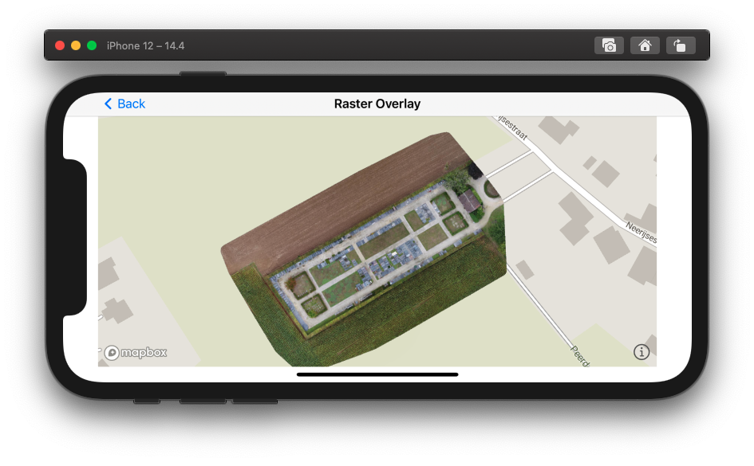

# Raster Overlay

This example shows how to add a raster overlay to the map. The image is deployed to the device as a bundled resource. You will need a raster and its bounding rectangle in geographic coordinates.

## Include Raster to the project

In Xcode, create new group (e.g. Files). Right click on the group and choose "Add files to..." Locate your raster file and add it to the project.

## Add the raster overlay

The overlay should be added after the map view finishes loading the style. Add the following method to the coordinator class (which implements ```MGLMapViewDelegate``` protocol):

```swift
func mapView(_ mapView: MGLMapView, didFinishLoading style: MGLStyle) {
    ...
}
```

### Image coordinates

In order to display the image on map, it is necessary to set the image extent in geographic coordinates.

```swift
snippet(RasterOverlay.swift#SetRasterCoordinates)
```

### Image Source

Next, create image source from the embedded image.

```swift
snippet(RasterOverlay.swift#CreateImageSource)
```

### raster Layer

Last step is to create raster layer.

```swift
snippet(RasterOverlay.swift#CreateRasterLayer)
```

And add it to the style.

```swift
snippet(RasterOverlay.swift#InsertRasterLayer)
```


