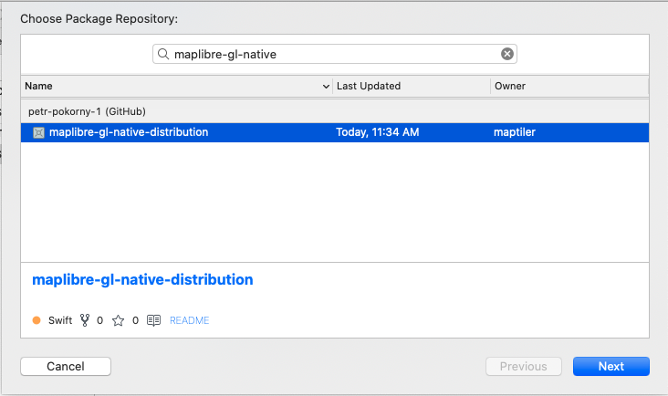
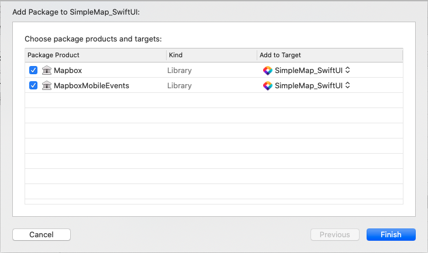

# MapTiler Tutorial for iOS SwiftUI/Swift

This tutorial describes how to create a simple iOS application using Swift and SwiftUI.

> This tutorial was written for macOS

## Create new project

Open Xcode and create new project. Choose iOS -> App template. In the "Choose options for your new project" select Interface to "SwiftUI", lifecycle to "SwiftUI App", language to "Swift"

## Add MapLibre Native SDK for iOS

Add MapLibre SDK to your project using Swift Package Manager.

1. To add a package dependency to your Xcode project, select File > Swift Packages > Add Package Dependency and enter its repository URL. You can also navigate to your target’s General pane, and in the “Frameworks, Libraries, and Embedded Content” section, click the + button, select Add Other, and choose Add Package Dependency.
1. Either add MapTiler GitHub distribution URL (https://github.com/maptiler/maplibre-gl-native-distribution) or search for `maplibre-gl-native` package.

1. Choose "next". Xcode should clone the distribution repository and download the binaries. Choose both mapBox and MapBox Mobile Events libraries.


## Create the SwiftUI View for the map

In your project, add new SwiftUI View to the SimpleMap_SwiftUI folder and name it `MapView.swift`

## MapTiler Key

1. Create [MapTiler cloud](https://www.maptiler.com/cloud/) account.
1. [Obtain the api key](https://cloud.maptiler.com/account/keys).
1. Set the MapTilerKey property in `SimpleMap_SwiftUI/info.plist` to the value obtained in the previous step.
1. Add the following method to MapView.swift. The method will MapTilerKey from property list.

```swift
snippet(MapView.swift#GetKey)
```

## Create MapBox map view

1. In your project, add new SwiftUI View to the SimpleMap_SwiftUI folder and name it `MapView.swift`
1. In order to use native UIKit views in SwiftUI view, you must use `[UIViewRepresentable](https://developer.apple.com/documentation/swiftui/uiviewrepresentable)` wrapper. The instance of custom type which adopts `UIViewRepresentable` protocol is responsible for creation and management a UIView object in your SwiftUI interface.

    ```swift
        struct MapView: UIViewRepresentable {
            ...
        }
    ```

1. The `UIViewRepresentable` requires to implement `makeUIViewController(context:)` method that creates the instance of with the desired UIKit view. Add the following code to create map view instance

    ```swift
    snippet(MapView.swift#MapInit)
    ```

1. The `UIViewRepresentable` view also requires to implement `updateUIView(_:context:)` which is used to configure the newly created instance. We dont need to configure anything so we will keep it empty.

    ```swift
    snippet(MapView.swift#UpdateMapView)
    ```


## Respond to map events

If order to to respond to map events, for example perform an action after MapView initialization finished. In SwiftUI, a `Coordinator` can be used with delegates, data sources, and user events. The `UIViewRepresentable` protocol defines `makeCoordinator()` method which creates coordinator instance. Add the following code to declare coordinator class:

```swift
snippet(MapView.swift#Coordinator)
```

And then add the following method to the SwiftUI view:

```swift
snippet(MapView.swift#MakeCoordinator)
```

And finally set the reference coordinator on mapbox map view

```swift
    mapView.delegate = context.coordinator
```


